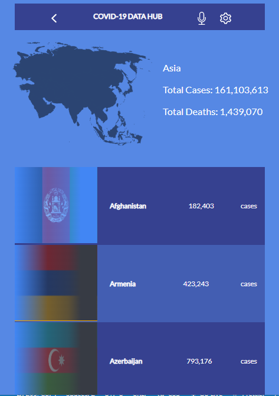

# COVID-19 DATA HUB

> This is a webapp that display metric data from an API for Covid-19 cases globally

Interactions

Home page

When the page loads, the webapp shows the list of categories that could be filtered out by some parameter.
Along with the category name, it displays some numeric values per category that come from the API.
When the user clicks (or taps) on a category item, the application navigates to the details page.

Details page

In the details page, the webapp retrieves data from the API to show detailed data in the category.
When the user clicks on the "Back" button (<), the user navigates to the home page.

## Built With

- Javascript, HTML, CSS
- React
- Redux
- API

## Live Demo

[Live Demo Link](netlify.app/)

## Project Description

Click here to watch a [video](https://www.loom.com/share/5b85672c9c3e4965b969d3bae797fdb1) that gives a brief description of the project

## Getting Started

- To get a local copy up and running follow these simple example steps.

# Setup

- git clone https://github.com/ppmarq1/covid-19-data-hub.git

### Prerequisites

- Have a working and updated browser.
- Have a local version control like **git** install on your computer.
- Have an account and sign in on GitHub, as online/remote version control system.
- Download waves to check project accessibilty.

### Install

- Lighthouse (An open-source, automated tool for improving the quality of web pages. It has audits for performance, accessibility, progressive web apps, SEO and more).

- Webhint (A customizable linting tool that helps you improve your site's accessibility, speed, cross-browser compatibility, and more by checking your code for best practices and common errors).

- Stylelint (A mighty, modern linter that helps you avoid errors and enforce conventions in your styles).

- ESlint (A mighty, modern linter that helps you avoid errors and enforce conventions in JavaScript codes)

### Create React App

- npx create-react-app my-app
- npm install redux react-redux
- cd my-app
- npm run start

### Run tests

- **npx hint .** : To test html codes
- **npx stylelint "**/\*.{css,scss}"\*\* : To test css code
- **npx eslint .** : To test Eslint Report
- **npm run test** : To run the tests.

### Deployment

- Go to settings
- Click on pages
- Choose your source
- Choose folder
- choose a theme(optional)
- Enforce HTTPS
- And then save

## Authors

👤 **Pedro Marques**

- GitHub: https://github.com/ppmarq1
- Twitter: https://twitter.com/ppmarq1
- LinkedIn: https://br.linkedin.com/in/pedroalmeidamarques/

## 🤝 Contributing

Contributions, issues, and feature requests are welcome!

Feel free to check the [issues page](https://github.com/ppmarq1/covid-19-data-hub/issues).

## Show your support

Give a ⭐️ if you like this project!

## Acknowledgments

- Hat tip to anyone whose code was used
- Inspiration
- UI Inspired by [Nelson Sakwa](<https://www.behance.net/gallery/31579789/Ballhead-App-(Free-PSDs)>) on Behance

## 📝 License

This project is [MIT](./MIT.md) licensed.
